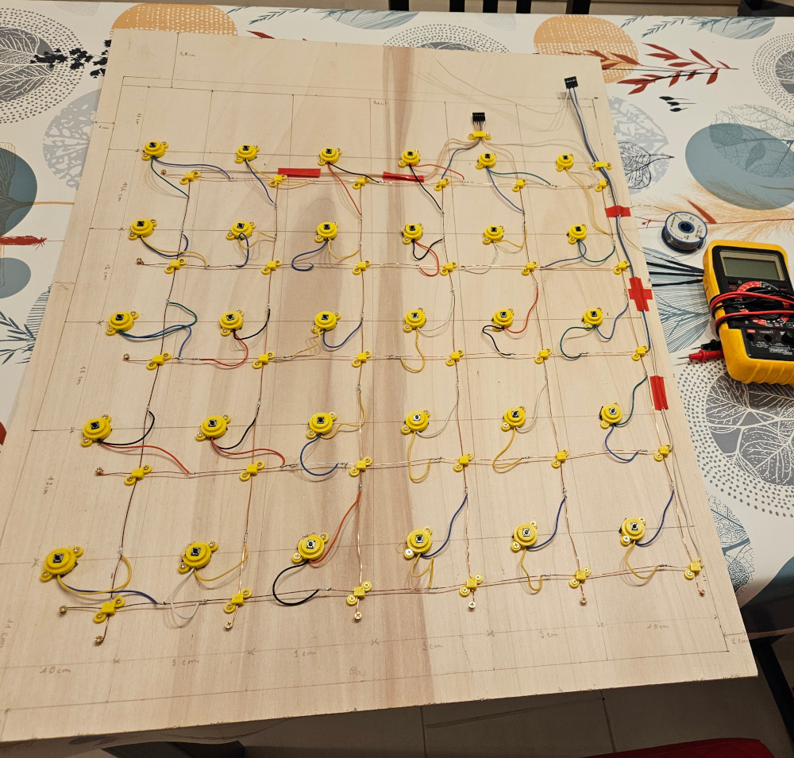
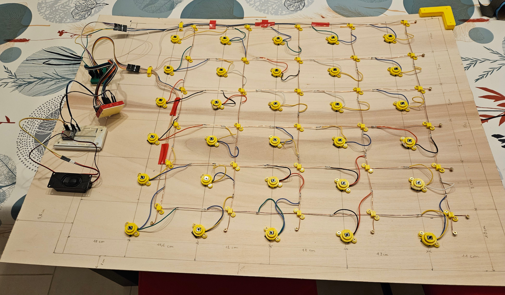

# Projet de mur sonore.

Work in progress :-)

* 2024-11-17 : prototype fonctionnel, utilsation du [loto sonore](https://dessinemoiunehistoire.net/loto-sonore/)

## But du projet

Réaliser un mur de 30 touches au dessus de petites pochettes.
Chaque pochette permet de placer une image ou vignette en correspondance avec l'extrait sonore qui sera joué lors de l'appui sur la touche.

Cela permet de faire un jeu d'apprentissage ludique pour les enfants de maternelle et élémentaire.

## Ressources nécessaires 

### Outils
* Du temps et de la patience :-)
* Une imprimante 3D (ou bricolage, mais l'imprimante 3D ça aide)
* Un fer à souder
* Une pince à sertir et des connecteurs dupont

### Matériel
* une plaque de bois de 80x60 cm de 5 mm d'épaisseur
* une plaque de mdf de 80x60 cm de3mm d'épaisseur
* du fil de cuivre rigide genre fil téléphonique
* des petits [boutons poussoir](https://amzn.eu/d/gBY2v1u) (x30)&nbsp;&nbsp; 
* Un module [DFPlayerMini](https://wiki.dfrobot.com/DFPlayer_Mini_SKU_DFR0299#target_6)
* Une arduino nano (nano every pour utiliser l'écran Oled, la SSD1306 sature les 2 Ko RAM du micro controleur)
* Une carte µSD
* [Optionnel] Un module d'alimentation 5V avec une batterie litium (en option, sinon utiliser un chargeur de téléphone et un cable usb)
* de la petite visserie M3x8 ou M2x8

## Assemblage

Imprimer les différentes pièces en 3D 
    * 30x support bouton
    * 30x croix clavier
    * 2x passe_cable
    * 4x angle
    * 4x bord plat

assembler tout ça :-) 

Puis brancher les arduino, DFPlayer mini et relier le clavier

## Chargement du micro programme

Compiler avec vscode avec l'extension platformio.
Uploader le microprogramme sur la arduino nano

## Chargement des mp3 sur la carte 

## Pour aller plus loin.

* Alimenter le mur sonore avec une [batterie au lithium](https://amzn.eu/d/602b4QF) &nbsp;&nbsp; 

* Mettre un petit [écran OLED i2c](https://amzn.eu/d/2jEcmg8) pour afficher le "jeu" en cours. &nbsp;&nbsp;  

* Ajouter un mode auto-correction avec un [lecteur NFC](https://amzn.eu/d/7pkhMIp) (nécessite d'ajouter une [puce NFC](https://amzn.eu/d/e6GDEvx) dans chaque vignette) &nbsp;&nbsp;   &nbsp;&nbsp;  

## Notes / retour d'expérience

* Le bois utilisé comme support travaille avec l'humidité et se gondole un peu. Pour les prochaines réalisation, peut etre partir plutot sur du plexi ou du pvc.

# Configuration des broches des arduino

arduino mega :  https://www.electronicshub.org/arduino-mega-pinout/

arduino nano : https://www.electronicshub.org/arduino-nano-pinout/

arduino nano every : https://docs.arduino.cc/hardware/nano-every/

